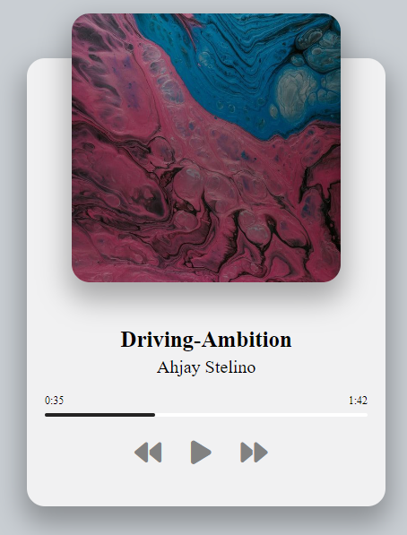

# Music Player



## Table of Contents

- [Overview](#overview)
- [Features](#features)
- [Demo](#demo)
- [Getting Started](#getting-started)
  - [Prerequisites](#prerequisites)
  - [Installation](#installation)
- [Usage](#usage)
- [Customization](#customization)
- [Technologies Used](#technologies-used)

## Overview

This music player is a simple and stylish web application created using HTML, CSS, and JavaScript. It provides an intuitive interface for playing music tracks, complete with features like play/pause controls, track navigation, and progress tracking. The player's responsive design ensures it's accessible across various devices and screen sizes.


## Features

- Play and pause your favorite songs.
- Easily skip to the next or previous track.
- Control the playback progress using the progress bar.
- Display the current time and duration of the song.
- Responsive design for seamless use on different devices.

## Demo

You can see a live demo of the music player [here](https://jsmusic-player.netlify.app).

## Getting Started

### Prerequisites

You need a modern web browser to run the music player.

### Installation

1. Clone the repository to your local machine:

   ```bash
   git clone https://github.com/SyedAbdullah01/music-player.git
2. Open the `index.html` file in your web browser to start using the music player.

   ## Usage

- Click the play button to start playing the current song.
- Click it again to pause the song.
- Use the next and previous buttons to navigate between tracks.
- Click on the progress bar to skip to a specific part of the song.
- The player displays the current time and the total duration of the song.

## Customization

You can customize this music player by adding your own songs. To do this, follow these steps:

1. Add your audio files (in MP3 format) to the `music/` directory.
2. Add corresponding image files (in JPG format) to the `img/` directory.
3. Update the `songs` array in `script.js` with the details of your songs.

   ```javascript
   let songs = [
     {
       name: "your-song-file-name-without-extension",
       displayName: "Your Song Display Name",
       artist: "Artist Name",
     },
     // Add more songs here
   ];
4. Open index.html in your browser to enjoy your custom music player.

## Technologies Used

- **HTML**: Used for structuring the web page and its elements.
- **CSS**: Used for styling the music player and making it visually appealing.
- **JavaScript**: Used for implementing the functionality of the music player.
- **GitHub**: The codebase is hosted and shared on GitHub.
- **Netlify**: Deployed the live demo of the music player.


Enjoy your music and happy coding! 🎶
